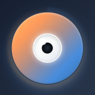
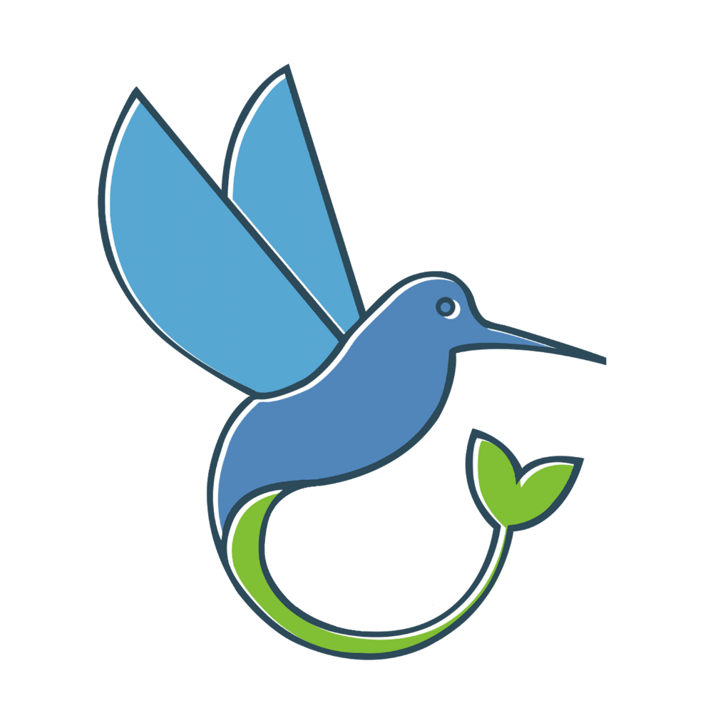

  

  <h1>Santiago Echeverri</h1>
  <h3>Senior Full-Stack Engineer | Tech Lead | Applied AI, ML & Computer Vision</h3>

  

    <strong>20+ years building production software across SaaS, HealthTech, fintech, system design, cloud infrastructure, integrations, and applied AI.</strong>
  

  

    
    
    
    
  

  

    <strong>Based in Merida, Mexico | Remote work across LATAM, US, and global teams</strong>
  

## About

I am a Senior Full-Stack Engineer and Tech Lead with more than 20 years of experience in software architecture, full-stack development, cloud infrastructure, and production systems across SaaS, HealthTech, fintech, and applied AI projects.

I work across backend architecture, frontend products, system design, distributed systems, SQL, AWS, Docker, CI/CD, third-party integrations, code evaluation, and production delivery. Recent work includes AI-assisted software engineering, LLM code evaluation, AI-generated code review, Docker-based validation, test/evaluation harnesses, computer vision, and applied machine learning.

## Core Strengths

- Technical leadership, architecture, and production delivery
- Full-stack product development with React, Next.js, Node.js, Laravel, and TypeScript
- Backend architecture, system design, distributed systems, APIs, databases, and multi-user workflows
- Cloud infrastructure, Docker, CI/CD, monitoring, and deployment strategy
- Stripe, Mapbox, Firebase, messaging, CRM, and third-party integrations
- AI-assisted software engineering, LLM training, LLM code evaluation, and AI-generated code review
- Computer vision, machine learning, test/evaluation harnesses, and software quality assessment

## Featured Projects

<table>
  <tr>
    <td width="50%" valign="top">
      <h3 align="center">RN RightNow</h3>
      

        
      

      
<strong>On-demand healthcare service platform.</strong>

      
Lead full-stack development for healthcare service coordination across the US and Mexico, including backend architecture, service workflows, payments, scheduling, geolocation, and dispatch operations.

      
<strong>Highlights:</strong> Laravel, Python, Node.js, TypeScript, Stripe, Mapbox, AWS, CI/CD, MySQL, scheduling, multi-user workflows.

    </td>
    <td width="50%" valign="top">
      <h3 align="center">DevArea</h3>
      

        
      

      
<strong>Boutique Tech Lab for operational software and applied AI.</strong>

      
Lead architecture and full-stack development for operational software, automation, integrations, SaaS platforms, scope configurators, payments, bilingual web platforms, and production-ready systems.

      
<strong>Highlights:</strong> React, Node.js, Laravel, AWS, Docker, SQL, CI/CD, Stripe, SEO, transactional emails, anti-spam flows.

    </td>
  </tr>
  <tr>
    <td width="50%" valign="top">
      <h3 align="center">AI Coding Evaluation</h3>
      

        
      

      
<strong>AI-assisted software engineering and LLM training.</strong>

      
Evaluate AI-generated code and model outputs across coding tasks, pull request tasks, infrastructure-as-code scenarios, mini-repository evaluations, reasoning traces, and test/evaluation harnesses.

      
<strong>Highlights:</strong> LLM training, AI code evaluation, Docker validation, CI/CD workflows, tests, repository analysis, software quality assessment.

    </td>
    <td width="50%" valign="top">
      <h3 align="center">KanAI Vision</h3>
      

        
      

      
<strong>AI/ML and computer vision for farming environments.</strong>

      
Computer vision initiative for biosecurity, traceability, and animal monitoring, integrating edge devices, biometric hardware, cloud architecture, and low-connectivity workflows.

      
<strong>Highlights:</strong> Computer vision, AI/ML, edge/cloud architecture, AWS/Azure, 1st place at the 2025 State Innovation Award.

    </td>
  </tr>
  <tr>
    <td width="50%" valign="top">
      <h3 align="center">EPT Vision</h3>
      

        
      

      
<strong>Computer vision for animal welfare workflows.</strong>

      
AI-driven animal welfare tool for image-based classification, health issue detection, and lost-pet matching workflows.

      
<strong>Highlights:</strong> Python, PyTorch, FastAPI, PostgreSQL, model evaluation, MLOps, product integration.

    </td>
    <td width="50%" valign="top">
      <h3 align="center">Esperando por ti</h3>
      

        
      

      
<strong>Social and environmental platform.</strong>

      
Platform for animal and environmental protection, with backend, web, native mobile apps, Firebase, geolocation, media uploads, and real-time reporting.

      
<strong>Impact:</strong> 500+ animal adoptions and thousands of platform interactions.

    </td>
  </tr>
</table>

## Technical Stack

### Languages and Frameworks

### Backend, Data, Cloud, and Integrations

System design, distributed systems, microservices, REST APIs, GraphQL, serverless architectures, infrastructure-as-code, query optimization.

### AI and ML

AI-assisted software engineering, LLM training, LLM code evaluation, AI-generated code review, prompt/context engineering, evaluation harnesses, computer vision, model evaluation, MLOps.

### Quality and Delivery

Code review, automated testing, unit testing, test harnesses, TDD, Scrum, Kanban, software quality assessment.

### Enterprise and Earlier Stack

## Contact

  
  
  

  
<strong>Senior engineering, architecture, applied AI, and production software delivery.</strong>

