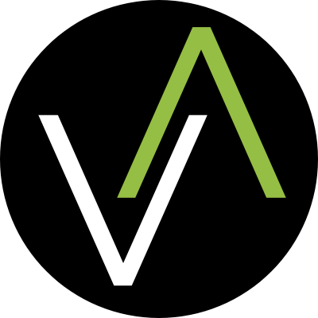

  
  
  <h1 align="center" style="font-size: 2.5em; margin-top: 20px; margin-bottom: 0px;">
    Santiago Echeverri
  </h1>
  <h2 align="center" style="color: #4CAF50; margin-top: 5px; margin-bottom: 20px; font-weight: 500;">
    Tech PM | Full Stack Engineer
  </h2>

  

    
  

  

    
    
    
    
    
  

  
  

    
  

  <h3 style="margin-top: 30px; margin-bottom: 10px;">Visitor Count:</h3>
  
  <!-- Visitor Counter -->
  

    
  

  
  <!-- Snake Animation -->
  

    <picture>
      <source media="(prefers-color-scheme: dark)" srcset="https://raw.githubusercontent.com/dassantoss/dassantoss/output/github-contribution-grid-snake-dark.svg" />
      <source media="(prefers-color-scheme: light)" srcset="https://raw.githubusercontent.com/dassantoss/dassantoss/output/github-contribution-grid-snake.svg" />
      
    </picture>
  

## 📋 About Me

Tech Project Director and Full Stack Developer with over 20 years of experience building software that is useful, scalable, and purpose-driven. I lead projects in healthcare, fintech, sustainability, civic tech, and social platforms—always bridging technical vision with real-world impact.

Currently directing DevArea, a boutique tech lab where we develop agile, high-impact solutions for startups and businesses. I'm also the co-founder of RN RightNow (HealthTech) and the creator of "Esperando por ti," a social and environmental platform.

My expertise ranges from designing backend architectures to leading distributed teams and applying machine learning to automate workflows. I combine modern technologies with clear, results-driven strategies to deliver technology that works: the kind that's on time, meaningful, and actually improves people's lives.

  

## 🚀 Services

<!-- Stripe Climate Badge -->

  <a href="https://climate.stripe.com/4vJ1xV" target="_blank" style="text-decoration: none; color: #4CAF50;">
    
    Every project with DevArea helps the planet too — we donate 1% to carbon removal initiatives through
  </a>

<table>
  <tr>
    <td align="center">
      <a href="https://wa.me/529999492450?text=Hello,%20I%20would%20like%20more%20information%20about:%20AI%20Solutions">
        
         
        <strong>AI & ML Solutions</strong>
      </a>
       
      
Custom AI models, computer vision systems, NLP solutions, and ML-powered analytics with up to 94% accuracy.

    </td>
    <td align="center">
      <a href="https://wa.me/529999492450?text=Hello,%20I%20would%20like%20more%20information%20about:%20Mobile%20Development">
        
         
        <strong>Mobile Development</strong>
      </a>
       
      
Native iOS/Android apps and cross-platform solutions that deliver exceptional user experiences.

    </td>
    <td align="center">
      <a href="https://wa.me/529999492450?text=Hello,%20I%20would%20like%20more%20information%20about:%20Web%20Development">
        
         
        <strong>Web Development</strong>
      </a>
       
      
Modern, responsive web applications built with React, Angular, Vue, Next.js, and Laravel.

    </td>
  </tr>
  <tr>
    <td align="center">
      <a href="https://wa.me/529999492450?text=Hello,%20I%20would%20like%20more%20information%20about:%20SaaS%20Development">
        
         
        <strong>SaaS Development</strong>
      </a>
       
      
Cloud-based subscription services with optimized architecture for scalability and performance.

    </td>
    <td align="center">
      <a href="https://wa.me/529999492450?text=Hello,%20I%20would%20like%20more%20information%20about:%20Database%20Development">
        
         
        <strong>Database Solutions</strong>
      </a>
       
      
High-performance database design, optimization, and migration for SQL and NoSQL systems.

    </td>
    <td align="center">
      <a href="https://wa.me/529999492450?text=Hello,%20I%20would%20like%20more%20information%20about:%20Information%20Security">
        
         
        <strong>Information Security</strong>
      </a>
       
      
End-to-end security audits, vulnerability assessments, and secure architecture implementation.

    </td>
  </tr>
</table>

## 🚀 Featured Projects

<table>
  <tr>
    <td width="50%" valign="top">
      <h3 align="center">RN Right Now</h3>
      

        
        
<strong>HealthTech Platform</strong>

        
An innovative healthcare platform connecting professionals with patients. As CTO, I designed the backend architecture with Laravel, led Stripe and Mapbox integrations, and implemented Scrum methodologies for our agile teams.

        

          
          
        

      

    </td>
    <td width="50%" valign="top">
      <h3 align="center">Esperando por Ti</h3>
      

        
        
<strong>Environmental & Animal Welfare Platform</strong>

        
As Founder and Product Owner, I defined the technological vision for this social and environmental platform, designed native mobile architecture, and integrated key technologies like Firebase. Enabled 500+ animal adoptions and numerous environmental initiatives.

        

          
          
        

      

    </td>
  </tr>
  <tr>
    <td width="50%" valign="top">
      <h3 align="center">EPT Vision</h3>
      

        
        
<strong>AI for Animal Welfare</strong>

        
Directed the development of this ML-powered solution that uses computer vision to assess animal health, detect diseases, and match lost pets. Achieved 93.94% accuracy in animal classification and 91.02% in health issue detection using PyTorch and FastAPI.

        

          
          
        

      

    </td>
    <td width="50%" valign="top">
      <h3 align="center">DevArea Projects</h3>
      

        
        
<strong>Boutique Tech Development</strong>

        
As Project Director at DevArea, I lead full stack development teams creating scalable solutions for international clients. We integrate modern technologies like React, Node.js, Laravel, and AWS with agile methodologies to deliver fast, high-quality results.

        

          
        

      

    </td>
  </tr>
</table>

## 💻 Tech Stack

  <h3>🚀 Core Skills</h3>
  

    
    
    
    
    
  

  
  <h3>🔥 Languages</h3>
  

    
    
    
    
    
    
    
    
  

  
  <h3>🧠 AI & Machine Learning</h3>
  

    
    
    
    
    
    
    
    
  

  
  <h3>🖥️ Frontend</h3>
  

    
    
    
    
    
    
    
  

  
  <h3>🔧 Backend</h3>
  

    
    
    
    
    
    
    
  

  
  <h3>🗃️ Database & Storage</h3>
  

    
    
    
    
    
  

  
  <h3>☁️ DevOps & Cloud</h3>
  

    
    
    
    
    
  

  
  <h3>📊 Project Management & Agile</h3>
  

    
    
    
    
    
  

## 📊 GitHub Stats

  
  

  

## 📈 GitHub Activity

  

## 💼 Experience

<table>
  <tr>
    <th>Position</th>
    <th>Company</th>
    <th>Field</th>
    <th>Period</th>
  </tr>
  <tr>
    <td><strong>Project Director & Lead Full Stack Developer</strong></td>
    <td><strong>DevArea</strong></td>
    <td>Technology Solutions</td>
    <td>2012-present</td>
  </tr>
  <tr>
    <td><strong>Co-founder & CTO</strong></td>
    <td><strong>RN Right Now</strong></td>
    <td>Healthcare Technology</td>
    <td>2021-present</td>
  </tr>
  <tr>
    <td><strong>Founder & Lead Full Stack Developer</strong></td>
    <td><strong>Esperando por Ti</strong></td>
    <td>Environmental & Animal Welfare</td>
    <td>2016-present</td>
  </tr>
  <tr>
    <td>Senior Full Stack Developer</td>
    <td>ID Technology SAS</td>
    <td>Technology Solutions</td>
    <td>2010-2012</td>
  </tr>
  <tr>
    <td>Senior Full Stack Developer</td>
    <td>WIN Software SAS</td>
    <td>Healthcare Technology</td>
    <td>2008-2010</td>
  </tr>
</table>

## 🏆 Industry Expertise

<table align="center" border="0" cellspacing="0" cellpadding="0">
  <tr>
    <td align="center" width="19%" style="padding:5px">
      

        
        <h3 style="margin: 0; font-size: 16px; color: white; font-weight: 600;">HealthTech</h3>
        
Healthcare platforms & telemedicine

      

    </td>
    <td align="center" width="19%" style="padding:5px">
      

        
        <h3 style="margin: 0; font-size: 16px; color: white; font-weight: 600;">FinTech</h3>
        
Payment & financial solutions

      

    </td>
    <td align="center" width="19%" style="padding:5px">
      

        
        <h3 style="margin: 0; font-size: 16px; color: white; font-weight: 600;">Sustainability</h3>
        
Environmental & animal welfare

      

    </td>
    <td align="center" width="19%" style="padding:5px">
      

        
        <h3 style="margin: 0; font-size: 16px; color: white; font-weight: 600;">GovTech</h3>
        
Government & digital citizenship

      

    </td>
    <td align="center" width="19%" style="padding:5px">
      

        
        <h3 style="margin: 0; font-size: 16px; color: white; font-weight: 600;">SaaS</h3>
        
Enterprise & B2B cloud solutions

      

    </td>
  </tr>
</table>

## 🎓 Education

<table>
  <tr>
    <td></td>
    <td>Machine Learning Specialization, Software Engineering</td>
  </tr>
  <tr>
    <td></td>
    <td>Diploma in Machine Learning</td>
  </tr>
  <tr>
    <td></td>
    <td>Microsoft Certified Professional (MCP) - ASP.NET, C#</td>
  </tr>
  <tr>
    <td></td>
    <td>Software Development Technician</td>
  </tr>
</table>

## 💼 Certifications

<table>
  <tr>
    <td></td>
    <td>Machine Learning Certification - <a href="https://diplomasmerida.anahuac.mx/42085d61-ff0b-4609-b81a-daaffd66de66#acc.8skJ4PnG" target="_blank">View Certificate</a></td>
  </tr>
  <tr>
    <td></td>
    <td>Machine Learning Specialization - <a href="https://diplomasmerida.anahuac.mx/b516cce2-fa92-4b03-bb7e-e4d888ac7977#acc.bVcS3kae" target="_blank">View Certificate</a></td>
  </tr>
</table>

## 🌱 🐾 ♻️ Contribute to Our Cause

  

Support "Esperando por ti", a social network dedicated to environmental protection and animal welfare. Our platform has facilitated over 500 animal adoptions, helped find more than 100 lost animals, managed over 10,000 tree adoption requests, and has more than 20,000 views of recycling points.

### Our Impact

<table>
  <tr>
    <td align="center">
      <h3>🐶 500+</h3>
      
Animal Adoptions

    </td>
    <td align="center">
      <h3>🔍 100+</h3>
      
Lost Pets Found

    </td>
    <td align="center">
      <h3>🌳 10,000+</h3>
      
Tree Adoptions

    </td>
    <td align="center">
      <h3>♻️ 20,000+</h3>
      
Recycling Points Views

    </td>
  </tr>
</table>

**Download the app:**
- [iOS](https://apps.apple.com/mx/app/esperando-por-ti/id1500077249)
- [Android](https://play.google.com/store/apps/details?id=mx.dacodes.esperandoporti&hl=es&gl=US)

**Support EPT:**

  

---

  <h3>Thanks for visiting my profile! Let's connect and build something amazing together.</h3>
  
  

    
    
    
  

  <!-- Support My Work -->
  

    
    
  

## 📞 Contact Me

  
  
  
  

  
Currently based in Yucatán, Mexico | Open to remote opportunities worldwide

